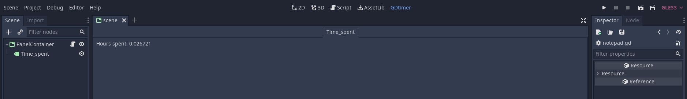

# GDmeter


The unassuming timer for Godot. Ideal for jams.


# Install

## AssetLib
With your project open in Godot:
1. Click on the AssetLib on the main dock and search for the __GDmeter__ plugin.
2. Click on the title of the plugin and _Download_.
3. Click on _Install_. You may want to remove the images (`*png`, `*svg`)

## From source
1. Clone the repository or download it.
```
git clone https://github.com/carrascomj/gdmeter.git
```
2. If you do not have an `addons/` folder in your project, create it.
3. Copy the directory `addons/gdmeter/` into the addons folder of your project.
4. Inside Godot, go to _Project > Project settings > Plugins_ and enable GDmeter.

# Usage
  

Click on the GDmeter tab (in the main dock, next to 2D, 3D, Script and AssetLib). As soon as you click, the timer will start and a log will be generated so the time is stored between sessions of the editor. This file is saved when the project is closed in the editor (the counter is updated automatically when
  closing the project).

If you close and open the editor, you have to go back again to the GDmeter tab to resume the timer; this time, starting from the saved time.
