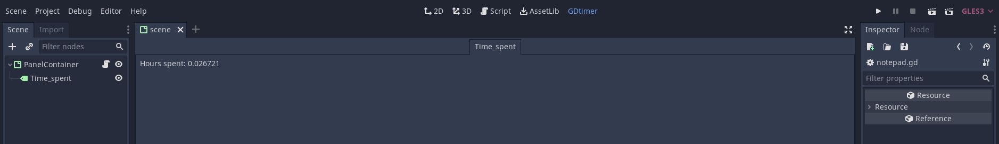

# GDmeter
The unassuming timer for Godot. Ideal for jams.

  

# Install
1. If you do not have an `addons/` folder in your project, create it.
2. Copy the directory `addons/gdmeter/` into the addons folder of your project.
3. Inside Godot, go to _Project > Project settings > Plugins_ and enable GDmeter.

# Usage
Click on the GDmeter tab (in the main dock, next to 2D, 3D, Script and AssetLib). As soon as you click, the timer will start and a log will be generated so the time is stored between sessions of the editor. This file is saved when the project is closed in the editor.you

If you close and open the editor, you have to go back again to the GDmeter tab to resume the timer; this time, starting from the saved time.
